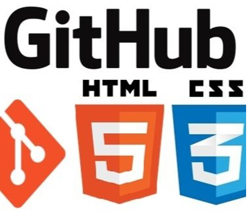

  
   
  <h3><b>Microverse First Project</b></h3>

# 📗 Table of Contents

- [📖 About the Project](#about-project)
  - [🛠 Built With](#built-with)
    - [Tech Stack](#tech-stack)
    - [Key Features](#key-features)
- [💻 Getting Started](#getting-started)
  - [Setup](#setup)
  - [Prerequisites](#prerequisites)
- [👥 Authors](#authors)
- [📝 License](#license)

# 📖 Hello World Microverse 

**Hello World Microverse** is our first project. We were practicing all related about: Git/GitHub, Linters, using Templates and a few of HTML/CSS.

## 🛠 Built With Visual Studio Code and NPM

### Tech Stack 

We built this project using tools as: Git client, Visual Studio Code and NPM.

  
Client

  <ul>
    <li>HTML</li>
    <li>CSS</li>
  </ul>

### Key Features 

We developed this exercise to test some skills using Git/GitHub and Linters.

(<a href="#readme-top">back to top</a>)

## 💻 Getting Started 

This job was suggested only for educative purposes.

### Setup

Clone this repository to your desired folder:

  cd my-folder
  git clone git@github.com:jlcarrascof/hello-world-project.git

(<a href="#readme-top">back to top</a>)

### Prerequisites

In order to run this project you only need a web browser. 

### Usage

To run the project, execute the following command:

N/A

## 👥 Authors 

👤 Javier J. Martínez F.

- GitHub: [@jlcarrascof]
- Twitter: [@javiersistemas]

(<a href="#readme-top">back to top</a>)

## 📝 License 

This project is [MIT](./LICENSE.md) licensed.

(<a href="#readme-top">back to top</a>)
